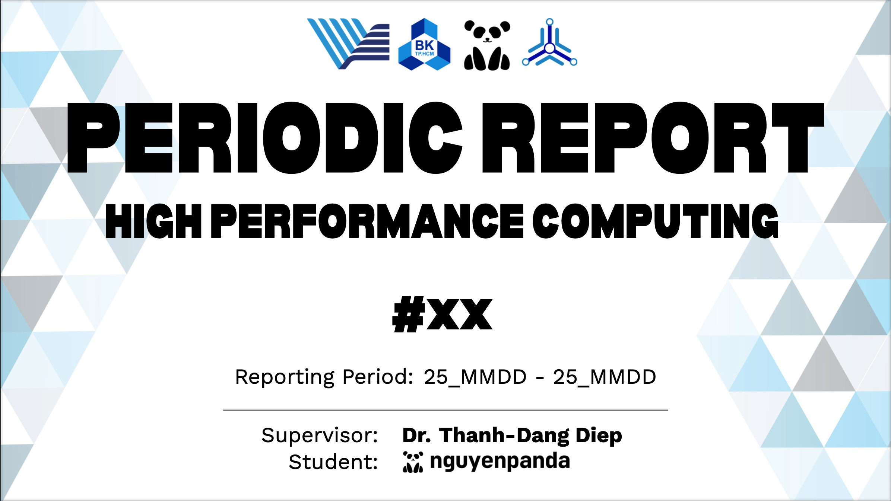
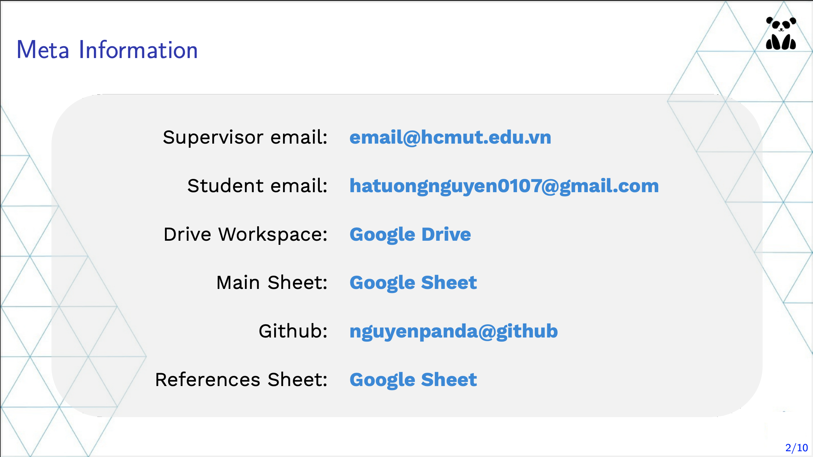

# Panda Report Slide: A LaTeX Template

[](https://opensource.org/licenses/MIT)

<!DOCTYPE html>
<html lang="en">
    <body>
        <p></p>
    </body>
</html>

This LaTeX template for report slides was created by Ha Tuong Nguyen (a.k.a <a href="https://github.com/nguyenpanda">nguyenpanda</a>) for my research progress updates at <a href="https://oisp.hcmut.edu.vn/"><strong>Ho Chi Minh City University of Technology</strong></a>. Feel free to use it if you’d like. If you think it looks ugly, then f your damn opinion.

## How to build pdf

```bash
make full
```

## [Demo](pdf/main.pdf)

<p align="center">


</p>

## License

This project under the [MIT LICESEN](LICENSE.txt).

## Contact Information and Profiles 📧

<p align='center'>
<a href="mailto:hatuongnguyen0107@gmail.com"></a>&nbsp;&nbsp;
<a href="https://www.facebook.com/HaTuongNguyenkute"></a>&nbsp;&nbsp;
<a href="www.linkedin.com/in/nguyenpanda"></a>&nbsp;&nbsp;
<a href="https://pypi.org/user/nguyenpanda"></a>&nbsp;&nbsp;
</p>

**Hà Tường Nguyên (Mr.)**  
**Computer Science**  
<small>Office for International Study Programs | HCMC University of Technology</small>
